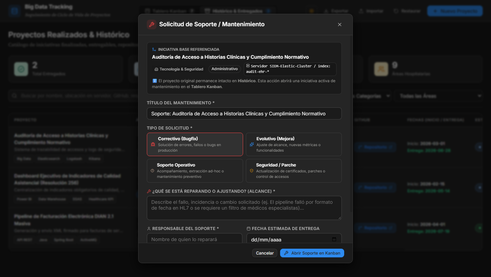

# 🚀 Projects Tracking — Platform & Lifecycle Management

Sistema web centralizado para la gestión, seguimiento visual y trazabilidad del ciclo de vida de iniciativas tecnológicas y proyectos de software (tales como Big Data, Pipelines ETL, Analítica, Integraciones y Dashboards Corporativos).

Diseñado bajo la filosofía del **Notion Design System**, con soporte nativo para **Modo Claro** y **Modo Oscuro (`data-theme="dark"`)**, tarjetas minimalistas, arrastre interactivo, catálogo histórico y sistema de linaje para mantenimiento continuo.

---

## 🎨 Módulos Principales

### 1. Tablero Kanban (Proyectos Activos & Alertas)

Visualiza el avance del ciclo de vida dividido en dos filas estratégicas: **Flujo de Desarrollo** (Análisis hasta Entrega) y **Estados de Alerta** (Pendientes, Retrasados y Pausados). Incorpora el efecto oficial de Notion donde cada columna transfiere sus colores temáticos a sus tarjetas, indicadores y botones de acción.


#### Características Clave:
- **Herencia de Color por Etapa (Color Columns)**: Fondos tintados suaves y bordes de acento para cada columna (*Análisis*, *Diseño*, *Desarrollo*, *Pruebas*, *Despliegue*, *Capacitación*, etc.).
- **Arrastre Fluido (Drag & Drop)**: Arrastre interactivo con `@formkit/drag-and-drop`. Al arrastrar a la columna *Pausado*, se solicita automáticamente la justificación de suspensión.
- **Acción Rápida `+` en Cabecera y Pie de Columna**: Botones discretos estilo Notion para añadir iniciativas directamente a una etapa específica.
- **Filtrado Avanzado**: Filtrado instantáneo por texto, categoría (*Administrativo* / *Asistencial*), área organizacional y tipo de iniciativa (**Todos**, **Solo Proyectos Base**, **Solo Soporte / Mantenimiento**).

---

### 2. Sistema de Linaje de Mantenimiento & Soporte (Parent-Child)

Resuelve la necesidad operativa de brindar soporte, correcciones y evolutivos a proyectos que ya fueron entregados formalmente, **sin alterar su fecha de entrega ni su historial de cierre**.



#### ¿Cómo Funciona el Linaje?
1. **Inmutabilidad del Proyecto Base**:
   - Cuando un proyecto culmina y pasa a estado `Entregado`, queda archivado e inmutable en el **Histórico**, preservando su fecha real de entrega y métricas para auditoría.
2. **Apertura de Incidencias / Requerimientos**:
   - Desde el *Histórico*, el *Detalle del Proyecto* o el menú contextual de la tarjeta en Kanban, se puede disparar la acción **"Abrir Soporte / Mantenimiento"**.
   - Se despliega el modal de mantenimiento, el cual hereda automáticamente el área, la categoría asistencial/administrativa, la ubicación en servidor y el repositorio de GitHub del proyecto padre.
3. **Tipificación Técnica**:
   - 🔴 **Correctivo (Bugfix)**: Corrección de errores, fallos o inconsistencias en producción.
   - 🔵 **Evolutivo (Mejora)**: Ampliación de alcance, nuevas métricas o funcionalidades adicionales.
   - 🟤 **Soporte Operativo**: Acompañamiento, extracciones de datos ad-hoc o mantenimiento preventivo.
   - 🟡 **Seguridad / Parche**: Actualización de certificados, parches de seguridad y control de accesos.
4. **Definición de Alcance**:
   - Campo obligatorio para documentar con precisión **qué componente o proceso se está reparando o ajustando**.
5. **Visibilidad en el Flujo de Trabajo (Kanban)**:
   - Los tickets de soporte nacen como tarjetas activas en el Kanban con un distintivo visual claro:
     - Pastilla con icono de herramienta: `🔧 Soporte de: [Nombre del Proyecto Base]`.
     - Recuadro contextual con el alcance puntual de lo que se está reparando.
6. **Trazabilidad Bidireccional**:
   - En el **Proyecto Base**: En el modal de detalle se visualiza la sección *"Historial de Mantenimientos & Soporte"* con todos los tickets asociados, sus estados y enlaces directos.
   - En el **Ticket Hijo**: Dispone de un enlace directo para consultar la iniciativa base referenciada.
   - En el **Histórico**: Cada proyecto muestra un badge con el total de soportes vinculados (`🔧 N Soportes vinculados`).

---

### 3. Histórico & Catálogo de Entregados

Catálogo general de proyectos finalizados y entregados con métricas ejecutivas, buscador en tiempo real y gestión de linaje.


#### Características Clave:
- **Acción Directa de Soporte**: Botón `Soporte` en la columna de acciones para abrir requerimientos vinculados con un solo clic.
- **Trazabilidad Técnica**: Muestra la ubicación exacta en servidor/clúster con botón de **Copiado en 1 Clic**.
- **Acceso a Repositorio**: Enlace directo al código fuente en GitHub.
- **Asignado a sin cortes**: Formato de celda protegido (`white-space: nowrap`) con iniciales en avatar translúcido.
- **Estado Final & Fechas**: Pastillas de estado translúcidas de alto contraste y fechas de entrega destacadas en verde esmeralda.

---

### 4. Modal de Detalle de Proyecto

Vista expandida al hacer clic en cualquier tarjeta o fila para inspeccionar todos los atributos técnicos del proyecto, cronograma, tecnologías y el historial de incidencias vinculadas.


---

### 5. Modal de Creación y Edición

Formulario completo para registrar y modificar iniciativas, con áreas organizacionales predefinidas, tags personalizables y validación de justificaciones.


---

## 💾 Importación y Exportación de Respaldos (JSON)

- **Exportar**: Descarga un respaldo completo `.json` con todos los proyectos registrados (incluyendo sus metadatos de linaje).
- **Importar con Decisión de Usuario**: Al subir un archivo JSON, el sistema valida la estructura y despliega un modal donde el usuario elige entre:
  - 🔀 **Fusionar con los actuales (Recomendado)**: Preserva los proyectos existentes y agrega los importados (actualizando coincidencias por ID).
  - ⚠️ **Reemplazar todo el catálogo**: Sobrescribe el almacenamiento local con la data del archivo.

---

## 🛠️ Stack Tecnológico

- **Core**: React 19 + TypeScript + Vite
- **Estilos**: Vanilla CSS Tokens (Notion Theme: *Inter*, *Source Serif Pro*, HSL & Translucent Palettes)
- **Drag & Drop**: `@formkit/drag-and-drop`
- **Iconografía**: `lucide-react`
- **Persistencia**: LocalStorage con fallback a datos iniciales de la industria de salud

---

## 🚀 Instalación y Uso

### 1. Clonar el repositorio
```bash
git clone https://github.com/programadorisgod/projects-tracking.git
cd projects-tracking
```

### 2. Instalar dependencias
```bash
pnpm install
# o con npm:
# npm install
```

### 3. Iniciar entorno de desarrollo
```bash
pnpm dev
```
La aplicación estará disponible en `http://localhost:5173/`.

### 4. Compilar para producción
```bash
pnpm build
```

---

## 📁 Estructura del Proyecto

```
projects-tracking/
├── docs/
│   └── screenshots/          # Capturas de pantalla actualizadas
├── src/
│   ├── components/
│   │   ├── History/          # Vista de tabla e histórico con badges de linaje
│   │   ├── Kanban/           # Tablero, columnas y tarjetas con soporte de mantenimiento
│   │   ├── Modals/           # Modales: Detalle, Edición, Pausa, Importación y Mantenimiento
│   │   └── Navbar.tsx        # Navegación superior con selector de tema
│   ├── services/
│   │   ├── initialData.ts    # Datos de semilla iniciales
│   │   └── storage.ts        # Persistencia, validación e import/export JSON
│   ├── styles/
│   │   ├── base.css          # Resets, tipografía y modales
│   │   ├── history.css       # Estilos de la tabla de histórico
│   │   ├── kanban.css        # Columnas temáticas, tarjetas y badges de soporte
│   │   └── tokens.css        # Design tokens oficiales de Notion (Claro/Oscuro)
│   ├── types/
│   │   └── project.ts        # Interfaces (Project, MaintenanceType, ProjectStatus)
│   ├── App.tsx
│   └── main.tsx
├── package.json
└── vite.config.ts
```

---

## 📄 Licencia

Este proyecto está bajo la Licencia MIT.
