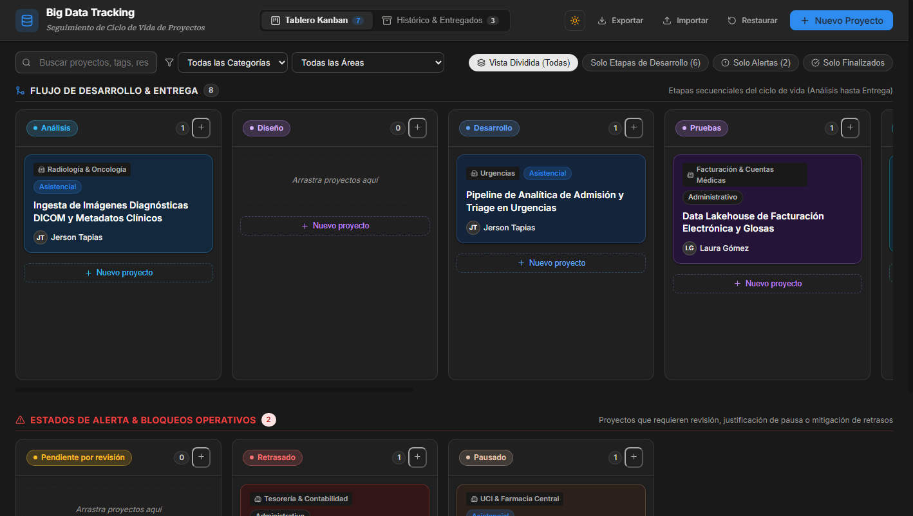
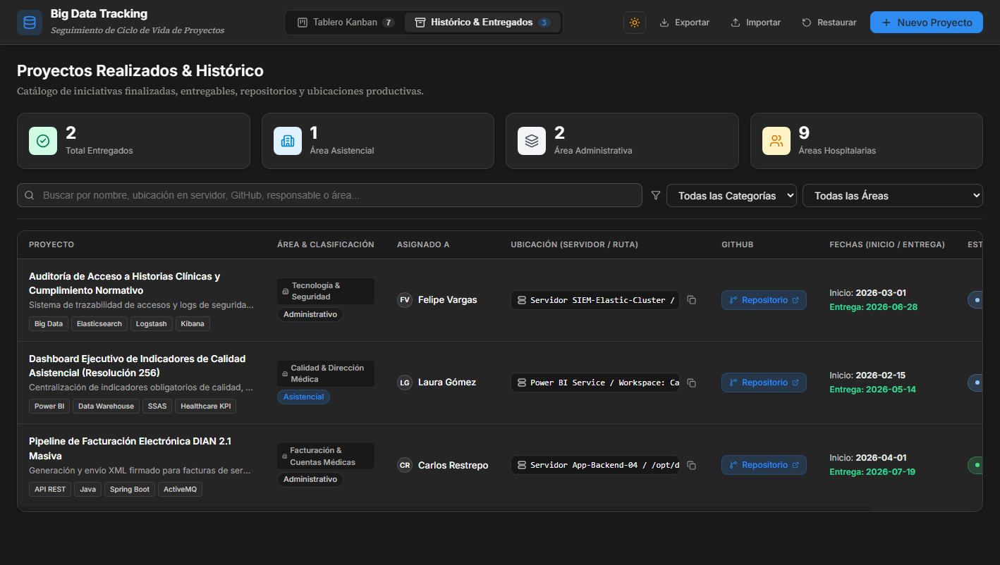
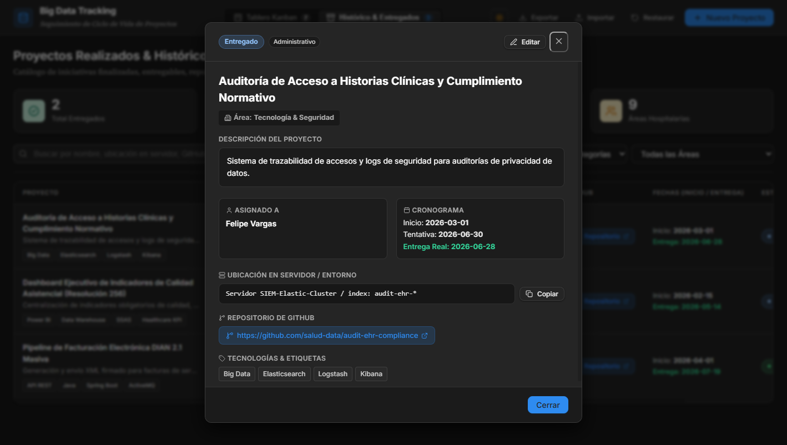
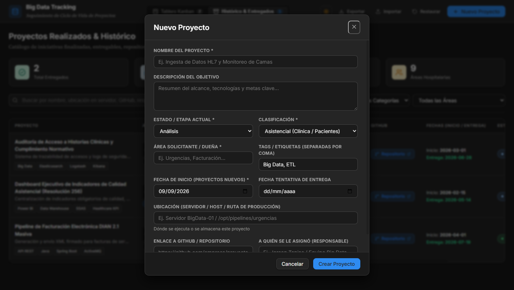

# 🚀 Projects Tracking — Platform & Lifecycle Management

Sistema web centralizado para la gestión, seguimiento visual y trazabilidad del ciclo de vida de iniciativas tecnológicas y proyectos de software (tales como Big Data, Pipelines ETL, Analítica, Integraciones y Dashboards Corporativos).

Diseñado bajo la filosofía del **Notion Design System**, con soporte nativo para **Modo Claro** y **Modo Oscuro (`data-theme="dark"`)**, tarjetas minimalistas, arrastre interactivo y tabla de catálogo histórico.

---

## 🎨 Módulos Principales

### 1. Tablero Kanban (Proyectos Activos & Alertas)

Visualiza el avance del ciclo de vida dividido en dos filas estratégicas: **Flujo de Desarrollo** (Análisis hasta Entrega) y **Estados de Alerta** (Pendientes, Retrasados y Pausados). Incorpora el efecto oficial de Notion donde cada columna transfiere sus colores temáticos a sus tarjetas, indicadores y botones de acción.



#### Características Clave:
- **Herencia de Color por Etapa (Color Columns)**: Fondos tintados suaves y bordes de acento para cada columna (*Análisis*, *Diseño*, *Desarrollo*, *Pruebas*, *Despliegue*, *Capacitación*, etc.).
- **Arrastre Fluido (Drag & Drop)**: Arrastre interactivo con `@formkit/drag-and-drop`. Al arrastrar a la columna *Pausado*, se solicita automáticamente la justificación de suspensión.
- **Acción Rápida `+ Nuevo proyecto`**: Botón al pie de cada columna que abre el modal preseleccionando esa etapa.

---

### 2. Histórico & Catálogo de Entregados

Catálogo general de proyectos finalizados y entregados con métricas ejecutivas, buscador en tiempo real y filtrado por área y clasificación.



#### Características Clave:
- **Trazabilidad Técnica**: Muestra la ubicación exacta en servidor/clúster con botón de **Copiado en 1 Clic**.
- **Acceso a Repositorio**: Enlace directo al código fuente en GitHub.
- **Asignado a sin cortes**: Formato de celda protegido (`white-space: nowrap`) con iniciales en avatar translúcido.
- **Estado Final & Fechas**: Pastillas de estado translúcidas de alto contraste y fechas de entrega destacadas en verde esmeralda (`#34d399`).

---

### 3. Modal de Detalle de Proyecto

Vista expandida al hacer clic en cualquier tarjeta o fila para inspeccionar todos los atributos del proyecto.



---

### 4. Modal de Creación y Edición

Formulario completo para añadir y modificar iniciativas, con áreas predefinidas de salud y administración, tags personalizables y validación de justificaciones.



---

## 💾 Importación y Exportación de Respaldos (JSON)

- **Exportar**: Descarga un respaldo completo `.json` con todos los proyectos registrados.
- **Importar con Decisión de Usuario**: Al subir un archivo JSON, el sistema valida la estructura y despliega un modal donde el usuario elige entre:
  - 🔀 **Fusionar con los actuales (Recomendado)**: Preserva los proyectos existentes y agrega los importados (actualizando coincidencias por ID).
  - ⚠️ **Reemplazar todo el catálogo**: Sobrescribe el almacenamiento local con la data del archivo.

---

## 🛠️ Stack Tecnológico

- **Core**: React 19 + TypeScript + Vite
- **Estilos**: Vanilla CSS Tokens (Notion Theme: *Inter*, *Source Serif Pro*, HSL & Translucent Palettes)
- **Drag & Drop**: `@formkit/drag-and-drop`
- **Iconografía**: `lucide-react`
- **Persistencia**: LocalStorage con fallback a datos iniciales de la industria de salud

---

## 🚀 Instalación y Uso

### 1. Clonar el repositorio
```bash
git clone https://github.com/programadorisgod/projects-tracking.git
cd projects-tracking
```

### 2. Instalar dependencias
```bash
pnpm install
# o con npm:
# npm install
```

### 3. Iniciar entorno de desarrollo
```bash
pnpm dev
```
La aplicación estará disponible en `http://localhost:5173/`.

### 4. Compilar para producción
```bash
pnpm build
```

---

## 📁 Estructura del Proyecto

```
projects-tracking/
├── docs/
│   └── screenshots/        # Capturas de pantalla para la documentación
├── src/
│   ├── components/
│   │   ├── History/        # Vista de tabla e histórico
│   │   ├── Kanban/         # Tablero, columnas y tarjetas minimalistas
│   │   ├── Modals/         # Modales de detalle, edición, pausa e importación
│   │   └── Navbar.tsx      # Navegación superior con selector de tema
│   ├── services/
│   │   ├── initialData.ts  # Datos de semilla iniciales
│   │   └── storage.ts      # Servicio de persistencia e import/export JSON
│   ├── styles/
│   │   ├── base.css        # Resets y modales
│   │   ├── history.css     # Estilos de la tabla de histórico
│   │   ├── kanban.css      # Sistema de columnas temáticas y tarjetas
│   │   └── tokens.css      # Design tokens oficiales de Notion (Claro/Oscuro)
│   ├── types/
│   │   └── project.ts      # Interfaces de TypeScript y configuración de estados
│   ├── App.tsx
│   └── main.tsx
├── package.json
└── vite.config.ts
```

---

## 📄 Licencia

Este proyecto está bajo la Licencia MIT.
