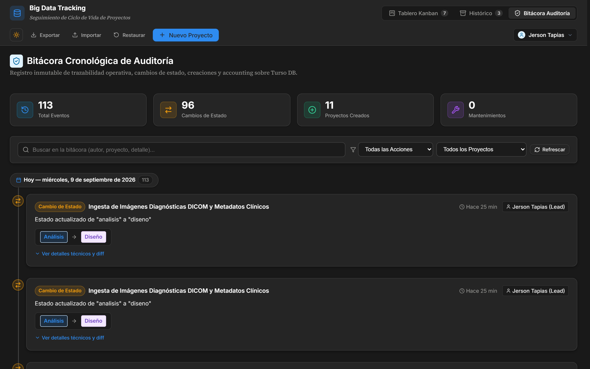
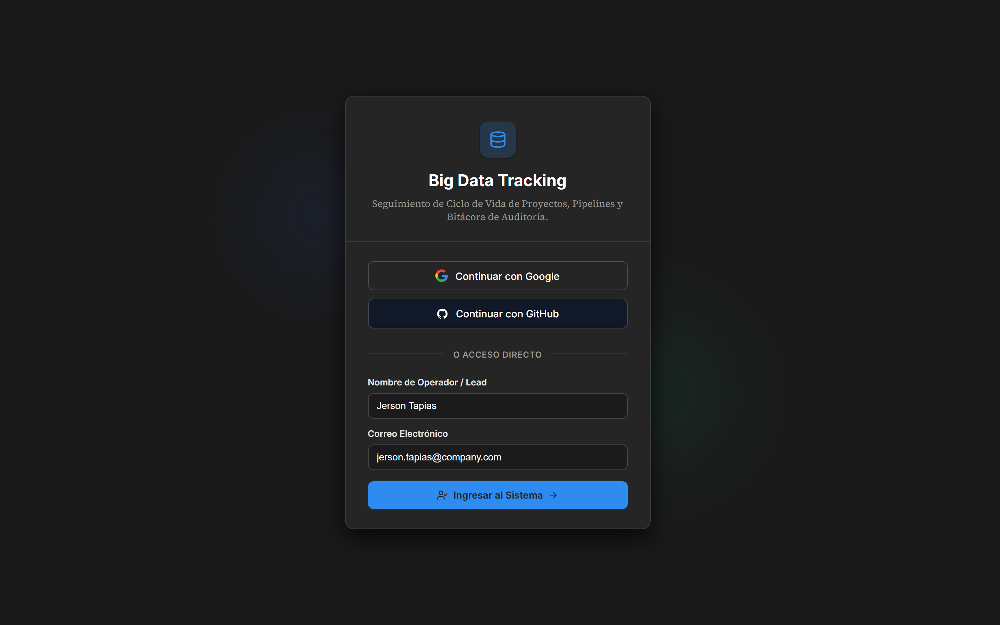
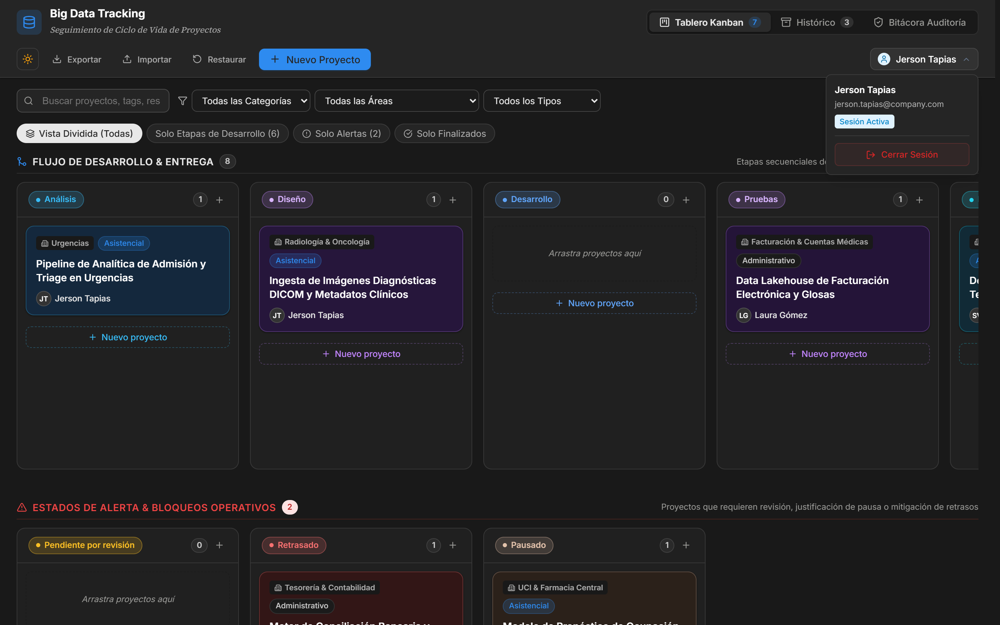

# 🚀 Projects Tracking — Platform, Lifecycle & Audit Management

Sistema web empresarial centralizado para la gestión, seguimiento visual, auditoría operacional y trazabilidad del ciclo de vida de iniciativas tecnológicas (Big Data, Pipelines ETL, Analítica Predictiva, Integraciones HL7/FHIR y Dashboards Corporativos).

Diseñado bajo la filosofía del **Notion Design System**, con soporte nativo para **Modo Claro** y **Modo Oscuro (`data-theme="dark"`)**, monorepo modular, base de datos en la nube en **Turso DB**, autenticación con **Better Auth** y actualización optimista instantánea (*Optimistic UI*).

---

## 🎨 Módulos Principales

### 1. Tablero Kanban & Flujo de Ciclo de Vida
Visualiza el avance del ciclo de vida dividido en dos filas estratégicas: **Flujo de Desarrollo** (Análisis hasta Entrega) y **Estados de Alerta** (Pendientes de Revisión, Retrasados y Pausados). Cada columna hereda sus colores temáticos a sus tarjetas, indicadores y botones de acción.


#### Características Clave:
- **Arrastre Fluido & Actualización Optimista (Optimistic UI 0ms)**: Estandarizado en el API nativo de HTML5 Drag & Drop. Al soltar una tarjeta, la interfaz se actualiza en el microsegundo 0 y sincroniza asíncronamente con Turso DB y la Bitácora con soporte de rollback.
- **Herencia de Color por Etapa**: Fondos tintados suaves y bordes de acento para cada columna (*Análisis*, *Diseño*, *Desarrollo*, *Pruebas*, *Despliegue*, *Capacitación*, etc.).
- **Detección de Pausas Justificadas**: Al arrastrar una iniciativa a la columna *Pausado*, se solicita modalmente la justificación operativa.
- **Acción Rápida `+` en Cabecera y Pie de Columna**: Botones discretos estilo Notion para añadir iniciativas directamente a una etapa específica.
- **Filtrado Avanzado**: Filtrado instantáneo por texto, categoría (*Administrativo* / *Asistencial*), área organizacional y tipo de iniciativa (**Todos**, **Solo Proyectos Base**, **Solo Soporte / Mantenimiento**).

---

### 2. Bitácora Cronológica de Auditoría (Accounting & Compliance)
Módulo de auditoría inmutable que registra cada evento operativo relevante dentro de la plataforma para fines de accounting, cumplimiento normativo y trazabilidad técnica.



#### Eventos Auditados:
- 🟢 **Creación de Proyectos**: Registro del estado inicial, área, responsable y metadatos base.
- 🟡 **Cambio de Estado**: Historial de movimientos entre columnas en el Kanban (estado previo $\rightarrow$ nuevo estado).
- 🔵 **Actualizaciones Generales**: Modificación de atributos, descripciones, responsables y fechas.
- 🔴 **Eliminaciones**: Trazabilidad del proyecto suprimido y marcas de tiempo (`deletedAt` en hora local del usuario `es-CO`).
- 🟣 **Soporte & Mantenimiento**: Registro de tickets correctivos, evolutivos o parches vinculados a iniciativas base.
- 🟠 **Operaciones de Base de Datos**: Eventos masivos de **Restauración a Valores de Fábrica** (`DATABASE_RESET`) e **Importación Masiva** (`DATABASE_IMPORTED`).

#### Características Técnicas:
- **Agrupación Cronológica por Fecha Local**: Agrupamiento inteligente basado en la zona horaria del cliente (`America/Bogota`), evitando desfases de medianoche producidos por UTC crudo.
- **Diff Técnico & Metadatos Expandibles**: Inspección del estado antes y después del cambio en formato JSON estilizado.
- **Búsqueda con Debounce (280ms)**: Búsqueda reactiva optimizada sin inundar el backend en cada pulsación de tecla.
- **Consultas Agregadas de Alto Rendimiento**: Estadísticas de auditoría calculadas en una única consulta SQL condicional en Turso DB.

---

### 3. Autenticación & Control de Acceso (Better Auth)
Protección de rutas y sesión de usuario mediante **Better Auth** con soporte para autenticación social y acceso directo de desarrollo:



- **Proveedores Soportados**:
  - 🌐 **Google OAuth**: Inicio de sesión corporativo vía Google Cloud Console.
  - 🐙 **GitHub OAuth**: Inicio de sesión vía GitHub OAuth Apps.
  - ⚡ **Acceso Rápido / Lead Access**: Botón directo para iniciar sesión local como *Líder Técnico (Jerson Tapias)*.
- **Compuerta de Login (`LoginPage.tsx`)**: Bloquea el acceso a la plataforma hasta que se autentique una sesión válida.
- **Perfil en Navbar con Popup**: La píldora del usuario se sitúa en el extremo derecho de la barra de navegación; al hacer clic, despliega un popup flotante con los datos del usuario, avatar y el botón **Cerrar Sesión** (con detección de clic exterior):



---

### 4. Sistema de Linaje de Mantenimiento & Soporte (Parent-Child)
Resuelve la necesidad operativa de brindar soporte, correcciones y evolutivos a proyectos que ya fueron entregados formalmente, **sin alterar su fecha de entrega ni su historial de cierre**.


#### Tipificación Técnica:
- 🔴 **Correctivo (Bugfix)**: Corrección de errores o inconsistencias en producción.
- 🔵 **Evolutivo (Mejora)**: Ampliación de alcance, nuevas métricas o funcionalidades adicionales.
- 🟤 **Soporte Operativo**: Acompañamiento, extracciones de datos ad-hoc o mantenimiento preventivo.
- 🟡 **Seguridad / Parche**: Actualización de certificados, parches de seguridad y control de accesos.

---

### 5. Histórico & Catálogo de Entregados
Catálogo general de proyectos finalizados y entregados con métricas ejecutivas, buscador en tiempo real y gestión de linaje.


- **Copiado al Portapapeles con Limpieza Activa**: Botón de copiado de ubicación en servidor con temporizadores seguros en memoria (`useRef`), evitando fugas de memoria.
- **Acceso a Repositorios**: Enlace directo al código fuente en GitHub.
- **Linaje Directo**: Contador de tickets de mantenimiento vinculados a cada iniciativa.

---

### 6. Modales de Gestión de Proyectos
- **Modal de Detalle**: Inspección profunda de atributos, cronograma y tickets de soporte asociados.


- **Modal de Creación y Edición**: Formulario integral con selección de áreas predefinidas, fechas estimadas y tags dinámicos.


---

## 💾 Persistencia, Exportación y Restauración en Base de Datos (Turso DB)

A diferencia de soluciones locales en `localStorage`, todas las operaciones de respaldo operan de forma transaccional sobre la base de datos distribuida en la nube:

1. **Restaurar Base de Datos (`POST /api/projects/reset`)**:
   - Limpia la tabla en Turso DB y reinserta los proyectos semilla originales.
   - Genera automáticamente un evento auditado de tipo `DATABASE_RESET`.
2. **Importar Proyectos (`POST /api/projects/import`)**:
   - Valida tanto sobres estructurados con metadatos (`{ version, exportDate, projects }`) como listas planas JSON.
   - **Modo Reemplazar**: Trunca y sobrescribe la base de datos con el nuevo conjunto de proyectos.
   - **Modo Combinar (Merge)**: Realiza un *upsert* transaccional (actualiza proyectos por coincidencia de `id` e inserta los nuevos).
   - Genera un evento auditado de tipo `DATABASE_IMPORTED`.
3. **Exportar Snapshot (`GET /api/projects/export`)**:
   - Genera un archivo `.json` firmado por el servidor con la versión del esquema, fecha ISO y todos los proyectos vivos en la base de datos.

---

## 🛠️ Stack Tecnológico

| Capa | Tecnologías |
| :--- | :--- |
| **Arquitectura** | Monorepo modular gestionado con `pnpm workspaces` |
| **Frontend** | React 19 + TypeScript + Vite |
| **Backend API** | Node.js + Express + TypeScript (`tsx watch`) |
| **Base de Datos** | Turso DB (`libSQL`) serverless distribuida + Drizzle ORM |
| **Autenticación** | Better Auth (Social OAuth: Google, GitHub + Email) |
| **Estilos & UI** | Vanilla CSS Tokens (Notion Theme: *Inter*, *Source Serif Pro*, palettes HSL) |
| **Modo Oscuro** | Soporte integral con tokens Notion de alto contraste en todas las vistas |
| **Iconografía** | `lucide-react` |
| **Linter & Calidad** | `oxlint` + `tsc` |

---

## ⚡ Optimizaciones de Rendimiento & Prevención de Fugas (Memory Leaks)

La plataforma fue auditada y optimizada para garantizar operaciones instantáneas a escala:
1. **Partición O(1) de Columnas en Kanban (`KanbanBoard.tsx`)**:
   - Se reemplazó el múltiple `.filter()` sobre arreglos por una sola pasada algorítmica (`Map<ProjectStatus, Project[]>`), reduciendo la complejidad computacional en cada renderizado de $O(K \times N)$ a $O(N)$.
2. **Consultas Agregadas en Turso DB (`audit.service.ts`)**:
   - Cálculo de métricas de auditoría en una única sentencia SQL agregada (`COUNT(CASE WHEN ... THEN 1 END)`), disminuyendo los viajes de red (roundtrips) a la base de datos de 4 a 1.
3. **Control de Ciclo de Vida y Prevención de Desmontajes Fantasma**:
   - `AuditView.tsx` implementa bandera reactiva `isCancelled` contra condiciones de carrera HTTP durante transiciones de pestañas.
   - Búsqueda en bitácora protegida con un temporizador `debounce` de 280ms.
4. **Manejo Seguro de Temporizadores con `useRef`**:
   - `HistoryView.tsx` y `ProjectDetailModal.tsx` utilizan referencias mutables (`copiedIdTimeoutRef`) con limpieza garantizada en `useEffect` cleanup, erradicando timers huérfanos que provocan advertencias de fuga de memoria (*memory leak warnings*).

---

## 📁 Estructura del Monorepo

```
big-data-tracking/
├── apps/
│   ├── client/                      # Frontend SPA (Vite + React 19)
│   │   ├── src/
│   │   │   ├── auth/                # Cliente de Better Auth (useSession, signOut)
│   │   │   ├── components/
│   │   │   │   ├── Audit/           # Módulo Bitácora: Timeline, Filtros, Métricas
│   │   │   │   ├── Auth/            # LoginPage y AuthBadge con popup
│   │   │   │   ├── History/         # Vista de Catálogo Histórico
│   │   │   │   ├── Kanban/          # Tablero Kanban, Columnas y Tarjetas
│   │   │   │   ├── Modals/          # Detalle, Edición, Importación, Mantenimiento
│   │   │   │   └── Navbar.tsx       # Barra de navegación principal
│   │   │   ├── services/            # Cliente HTTP API y Storage
│   │   │   ├── styles/              # Design tokens y hojas de estilo CSS Notion
│   │   │   ├── types/               # Tipos locales y reexportaciones
│   │   │   ├── App.tsx              # Componente raíz con Optimistic UI
│   │   │   └── main.tsx
│   │   └── vite.config.ts
│   │
│   └── server/                      # Backend REST API (Express + Turso)
│       ├── src/
│       │   ├── auth/                # Better Auth handler y extracción de actores
│       │   ├── db/                  # Conexión Turso libSQL, schema Drizzle y seeds
│       │   ├── modules/
│       │   │   ├── audit/           # Servicio y controlador de la Bitácora
│       │   │   └── projects/        # CRUD, import/export y reset de Proyectos
│       │   ├── config.ts            # Carga de variables de entorno (.env)
│       │   └── index.ts             # Servidor Express y bootstrap
│       └── tsconfig.json
│
├── packages/
│   └── shared/                      # Paquete compartido entre apps
│       └── src/
│           ├── audit.ts             # Tipos de eventos, filtros y estadísticas de auditoría
│           ├── project.ts           # Definiciones de Proyecto, Estados y Linaje
│           └── index.ts
│
├── docs/
│   └── screenshots/                 # Capturas de pantalla de la plataforma
├── pnpm-workspace.yaml              # Configuración de workspaces monorepo
├── package.json
└── README.md
```

---

## 🚀 Instalación y Puesta en Marcha

### 1. Clonar el repositorio
```bash
git clone https://github.com/programadorisgod/projects-tracking.git
cd projects-tracking
```

### 2. Instalar dependencias con `pnpm`
```bash
pnpm install
```

### 3. Configurar Variables de Entorno
Crea o edita el archivo `apps/server/.env`:
```env
PORT=3001
CLIENT_URL=http://localhost:5173
BETTER_AUTH_SECRET=tu-clave-secreta-super-segura-minimo-32-caracteres
BETTER_AUTH_URL=http://localhost:3001

# Turso Database Credentials
TURSO_DATABASE_URL=libsql://tu-base-de-datos.turso.io
TURSO_AUTH_TOKEN=tu-token-de-turso

# Social OAuth (Opcional para Google y GitHub)
GOOGLE_CLIENT_ID=tu-google-client-id
GOOGLE_CLIENT_SECRET=tu-google-client-secret
GITHUB_CLIENT_ID=tu-github-client-id
GITHUB_CLIENT_SECRET=tu-github-client-secret
```

### 4. Iniciar en Modo Desarrollo
Inicia tanto el backend Express como el frontend Vite en paralelo con un único comando:
```bash
pnpm dev
```
- **Cliente**: `http://localhost:5173/`
- **Servidor API**: `http://localhost:3001/`
- **Endpoints de Auditoría**: `http://localhost:3001/api/audit`

### 5. Compilación para Producción
Compila todos los paquetes y aplicaciones con validación estricta de tipos:
```bash
pnpm build
```

---

## 📄 Licencia

Este proyecto está bajo la Licencia MIT.
